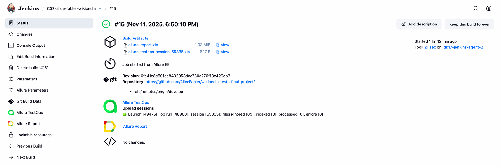
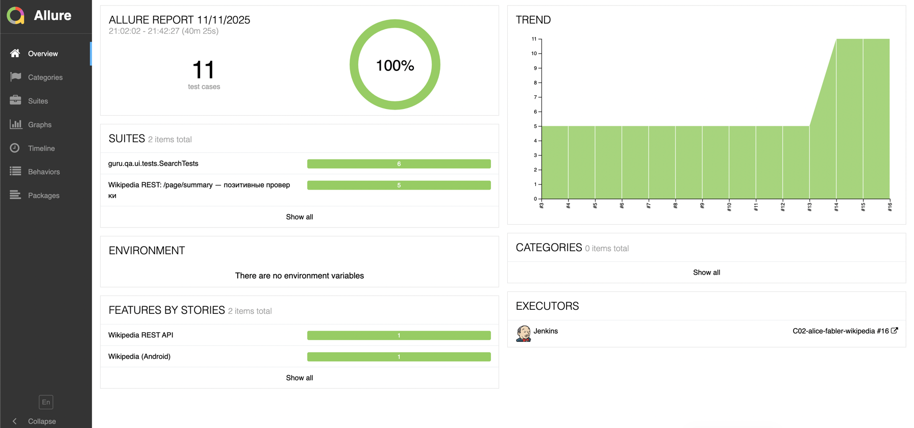
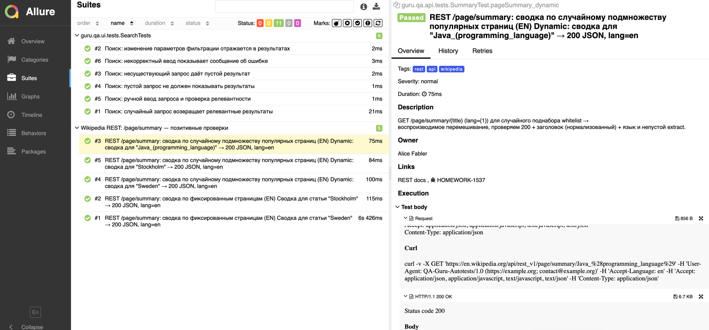
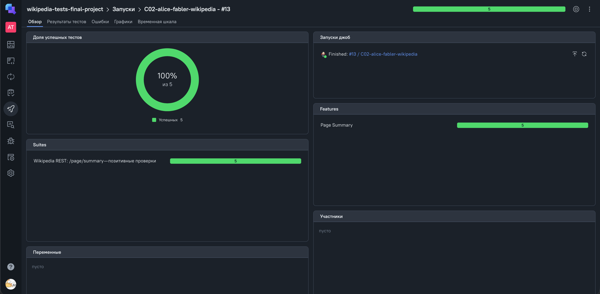
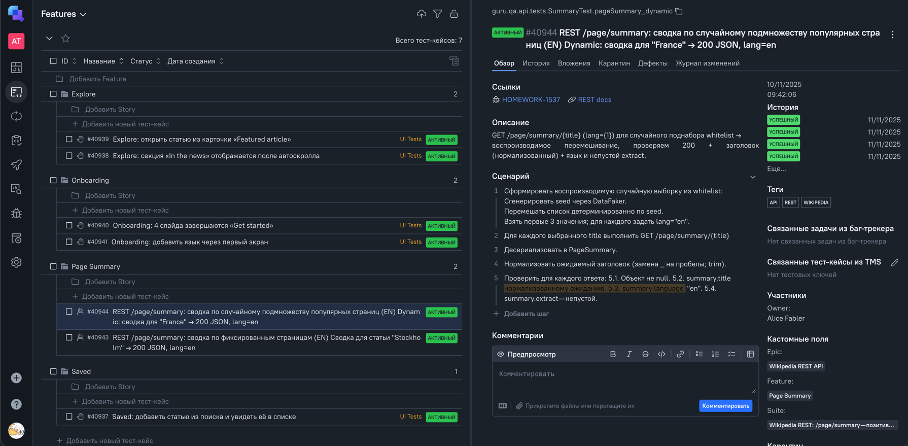
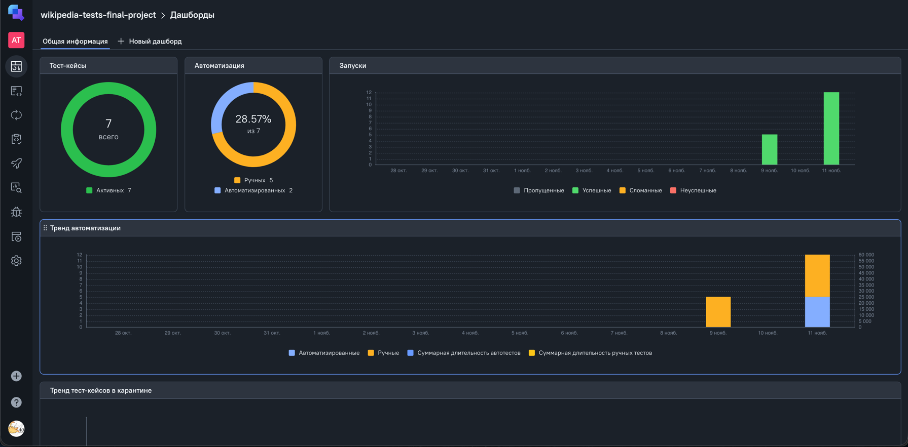
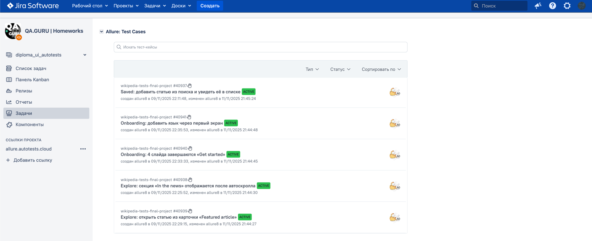
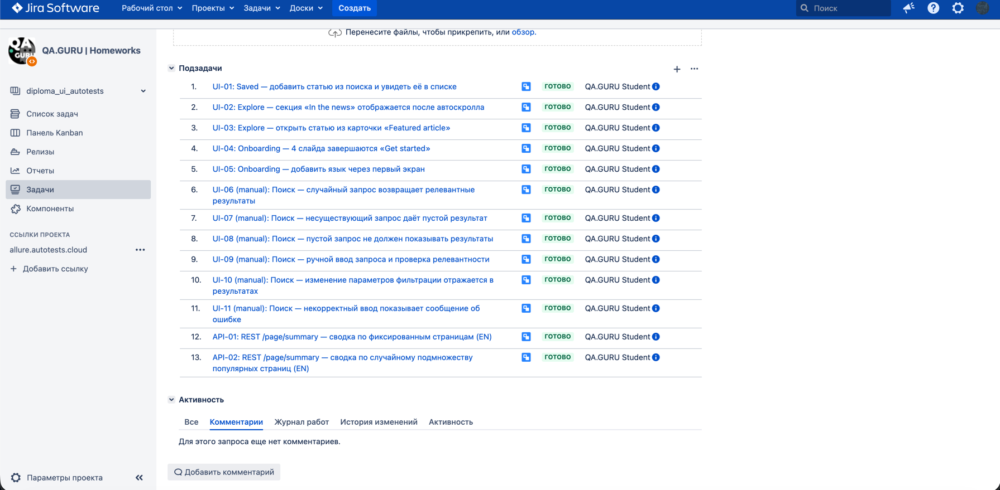
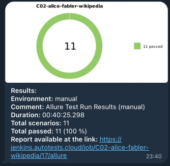

<p align="center">
  <a href="https://github.com/wikimedia/apps-android-wikipedia">
    
  </a>
</p>

<h1 align="center">Wikipedia Android — мобильные автотесты</h1>

<p align="center">
  <a href="https://jenkins.autotests.cloud/job/C02-alice-fabler-wikipedia/">Jenkins</a> •
  <a href="https://jenkins.autotests.cloud/job/C02-alice-fabler-wikipedia/allure/">Allure</a> •
  <a href="https://allure.autotests.cloud/project/4994/test-cases?treeId=0">Allure TestOps</a> •
  <a href="https://allure.autotests.cloud/launch/49473">Launch</a> •
  <a href="https://jira.autotests.cloud/browse/HOMEWORK-1523">Jira</a>
</p>

---

# Содержание
- [Технологии и стек](#tech)
- [Структура проекта](#structure)
- [Запуск](#run)
- [Отчёты (Allure)](#allure)
- [Интеграции (TestOps, Jira, Telegram)](#integrations)
- [Реализованные проверки (по коду)](#tests)
- [Ссылки](#links)
- [Уведомления в Telegram](#telegram)
- [Видео примера запуска тестов](#video)
- [Мини-чек-лист](#check)

---

<a name="tech"></a>
## 🧰 Технологии и стек

<p align="center">
<a href="https://www.jetbrains.com/idea/"></a>
<a href="https://www.java.com/"></a>
<a href="https://github.com/allure-framework"></a>
<a href="https://qameta.io/"></a>
<a href="https://gradle.org/"></a>
<a href="https://junit.org/junit5/"></a>
<a href="https://github.com/"></a>
<a href="https://www.jenkins.io/"></a>
<a href="https://web.telegram.org/"></a>
<a href="https://www.atlassian.com/software/jira/"></a>
<a href="https://www.browserstack.com/"></a>
<a href="https://appium.io/"></a>
<a href="https://rest-assured.io/"></a>
<a href="https://selenide.org/"></a>
</p>

- **Java 17**, **Gradle**
- **JUnit 5**
- **Selenide + Selenide-Appium**, **Appium Java Client**
- **Allure** (JUnit5 / Selenide / Rest-Assured)
- **Owner** (конфиги), **Lombok**, **SLF4J/Logback**
- **Rest-Assured** (REST)
- Поддержан локальный запуск (эмулятор) и удалённый (BrowserStack)

> Allure результаты складываются в корень репозитория: `allure-results`  
> В `build.gradle` есть задачи `allureReport` и `allureServe` (CLI скачивается автоматически в `allure/commandline`).

---

<a name="structure"></a>
## 📁 Структура проекта

Ниже — развёрнутая карта директорий **ровно по проекту**, с пояснениями по ролям файлов.

```
wikipedia-tests-final-project
└─ src/
   └─ test/
      ├─ java/
      │  └─ guru/qa/
      │     ├─ api/
      │     │  ├─ config/
      │     │  │  └─ ApiConfig.java              # Owner-конфиг для REST: baseUrl/lang/userAgent
      │     │  ├─ models/
      │     │  │  └─ PageSummary.java            # POJO-модель ответа /page/summary
      │     │  ├─ spec/
      │     │  │  └─ ApiSpecs.java               # Общие Request/Response Specs (Rest-Assured)
      │     │  ├─ WikipediaApi.java             # Обёртка над эндпоинтами (флюент/хелперы)
      │     │  └─ tests/
      │     │     └─ SummaryTest.java            # Параметризованные тесты /page/summary (@api, @rest)
      │     └─ ui/
      │        ├─ app/                           # Входная точка/фасады сценариев (если используются)
      │        ├─ config/                        # Owner-конфиги UI: Local/Remote/Auth (источники свойств)
      │        ├─ drivers/
      │        │  ├─ LocalDriver.java            # Локальный Appium 3; загрузка APK при необходимости
      │        │  └─ BrowserstackDriver.java     # Удалённый драйвер (pass-through капабилити)
      │        ├─ helpers/
      │        │  ├─ Attach.java                 # Скрины, page source, видео-ссылки в Allure
      │        │  └─ Browserstack.java           # Получение видео/метаданных
      │        ├─ logging/
      │        │  └─ PrettySelenideRuListener.java # Листенер Selenide с русскими логами
      │        ├─ screens/
      │        │  ├─ OnboardingScreen.java
      │        │  ├─ ExploreScreen.java
      │        │  ├─ SearchResultScreen.java
      │        │  ├─ ArticleScreen.java
      │        │  ├─ SavedScreen.java
      │        │  └─ TabsManagerScreen.java
      │        ├─ screens/components/
      │        │  ├─ BottomTabBar.java
      │        │  ├─ MoreSheet.java
      │        │  ├─ TocOverlay.java
      │        │  ├─ WikiSnackbar.java
      │        │  └─ WikiOverlays.java
      │        ├─ tests/
      │        │  ├─ TestBase.java               # Базовый класс тестов, выбор local|remote, аттачи
      │        │  ├─ OnboardingTests.java        # Онбординг: 4 слайда, добавление языка
      │        │  ├─ ExploreScreenTests.java     # Лента: In the news, Featured article → статья
      │        │  ├─ ArticleActionsTests.java    # Сохранение статьи в Saved
      │        │  └─ SearchTests.java            # manual-stub сценарии поиска
      │        └─ utils/gestures/
      │           ├─ AndroidMobileGestures.java  # mobile:* жесты (scrollGesture, swipeGesture, ...)
      │           └─ ScrollIntoView.java         # Доскролл до полной видимости элемента
      └─ resources/
         ├─ local.properties                     # Локальный запуск (Appium URL, APK, device и т.п.)
         ├─ remote.properties                    # Удалённый запуск (BrowserStack капабилити)
         ├─ auth.properties                      # Креды/URLs для удалённого провайдера
         ├─ api.properties                       # База и заголовки для REST-слоя
         ├─ testops.properties                   # Интеграция с Allure TestOps
         └─ allure.properties                    # Настройки Allure (включая путь allure-results)
```

### Примечания по слоям
- **api/** — полностью изолированный REST-слой: конфиг → спеки → клиент (WikipediaApi) → тесты.
- **ui/** — слой мобильных UI-тестов на Selenide‑Appium: драйверы (local/remote), экраны и компоненты, базовый тест и утилиты жестов.
- **resources/** — все Owner-файлы. Приоритет: `-D` → `ENV` → `classpath:${env}.properties` → `*.properties` по умолчанию.

## 🚀 Запуск

### Локально (эмулятор, Appium 3.x)
```bash
./gradlew clean local_test -DdeviceHost=local
```
Предусловия: Android Studio + эмулятор, Appium Server; APK подтянется автоматически (см. `local.properties` → `app.url/app.filename` либо локальный кеш).

### Удалённо (BrowserStack)
```bash
./gradlew clean remote_test -DdeviceHost=remote
```
Требуются `auth.properties`/`remote.properties` или соответствующие `-D`/ENV.

> **Важно про BrowserStack:** проект рассчитан на **Appium 3**. В публичных/учебных аккаунтах BrowserStack зачастую доступны только образы с Appium 2.x — из‑за этого удалённые прогоны **могут не стартовать**. Для запуска требуется: (1) **рабочая учётная запись** BrowserStack с доступными устройствами, (2) **поддержка Appium 3** на стороне провайдера (или ваш собственный Appium 3 Grid). Если это недоступно — используйте локальный профиль `-DdeviceHost=local`. 

### Дополнительно
- Запуск по тегам:
  ```bash
  ./gradlew tagged_test -Ptags=api,rest
  ```
- Отчёт Allure локально:
  ```bash
  ./gradlew allureReport      # генерация
  ./gradlew allureServe       # локальный просмотр
  ```

---

<a name="allure"></a>
## 📊 Отчёты Allure
- Jenkins Allure (последний билд):  
  https://jenkins.autotests.cloud/job/C02-alice-fabler-wikipedia/allure/
- Jenkins Allure (пример билда #13):  
  https://jenkins.autotests.cloud/job/C02-alice-fabler-wikipedia/13/allure/

---

<a name="integrations"></a>
## 🔗 Интеграции
- **Allure TestOps (проект/кейс-дерево):** https://allure.autotests.cloud/project/4994/test-cases?treeId=0  
- **Allure Launch:** https://allure.autotests.cloud/launch/49473  
- **Jira (родительская задача):** https://jira.autotests.cloud/browse/HOMEWORK-1523  
- **Telegram:** после завершения билда Jenkins бот шлёт сводку (диаграмма, счётчик passed, ссылка на отчёт)

---

<a name="tests"></a>
## ✅ Реализованные проверки (считано из кода)

Всего сценариев в репозитории: **13**  
Из них **автоматизировано: 7** (5 UI + 2 API); **manual-заглушки: 6**  

### UI — локальный/удалённый (`@android`, `@local`, `@remote`)
Классы: `OnboardingTests`, `ExploreScreenTests`, `ArticleActionsTests`

- **Онбординг / Онбординг**
  - Онбординг: 4 слайда последовательно завершаются кнопкой «Get started» _(Jira: HOMEWORK-1528; AllureId: 40940)_
  - Онбординг: добавить язык через первый экран (универсально по локализации) _(Jira: HOMEWORK-1529; AllureId: 40941)_

- **Explore / Лента**
  - Лента: секция «In the news» отображается после автоскролла _(Jira: HOMEWORK-1526; AllureId: 40938)_
  - Лента: открыть статью из карточки «Featured article» _(Jira: HOMEWORK-1527; AllureId: 40939)_

- **Saved / Сохранённые**
  - Сохранённые: добавить статью из поиска и увидеть её в дефолтном списке _(Jira: HOMEWORK-1525; AllureId: 40937)_

### API — REST (`@api`, `@rest`)
Класс: `SummaryTest` (параметризованные)

- REST /page/summary: сводка по фиксированным страницам (EN) _(Jira: HOMEWORK-1536; AllureId: 40943)_
- REST /page/summary: сводка по случайному подмножеству популярных страниц (EN) _(Jira: HOMEWORK-1537; AllureId: 40944)_

### Поиск — **manual-stub** (`@android`, `@manual`)
Класс: `SearchTests` (описательные шаги без UI-действий)

- Поиск: случайный запрос возвращает релевантные результаты _(Jira: HOMEWORK-1530)_
- Поиск: несуществующий запрос даёт пустой результат _(Jira: HOMEWORK-1531)_
- Поиск: пустой запрос не должен показывать результаты _(Jira: HOMEWORK-1532)_
- Поиск: ручной ввод запроса и проверка релевантности _(Jira: HOMEWORK-1533)_
- Поиск: изменение параметров фильтрации отражается в результатах _(Jira: HOMEWORK-1534)_
- Поиск: некорректный ввод показывает сообщение об ошибке _(Jira: HOMEWORK-1535)_

---

<a name="links"></a>
## 🔗 Прямые ссылки
### [Jenkins (job)](https://jenkins.autotests.cloud/job/C02-alice-fabler-wikipedia/)

<p align="center">

</p>

### [Jenkins (build #15)](https://jenkins.autotests.cloud/job/C02-alice-fabler-wikipedia/15/)

<p align="center">

</p>

### [Jenkins (Allure)](https://jenkins.autotests.cloud/job/C02-alice-fabler-wikipedia/allure/)

<p align="center">

</p>

<p align="center">

</p>

### [Allure Launch](https://allure.autotests.cloud/launch/49473)

<p align="center">

</p>

### [Allure TestOps](https://allure.autotests.cloud/project/4994/test-cases?treeId=9761)

<p align="center">

</p>

<p align="center">

</p>

### [Jira](https://jira.autotests.cloud/browse/HOMEWORK-1523)

<p align="center">

</p>

<p align="center">

</p>

<p align="center">

</p>

---

<a name="telegram"></a>
## Уведомления в Telegram

После завершения сборки, бот созданный в <code>Telegram</code>, автоматически обрабатывает и отправляет сообщение с результатом.

<p align="center">

</p>

----

<a name="video"></a>
## Видео примера запуска тестов

К каждому тесту в отчете прилагается видео прогона.
<p align="center">
  
</p>

---

<a name="check"></a>
### Мини-чек-лист
- [x] Список тестов и групп — **по коду**  
- [x] Теги и уровни — с аннотаций классов  
- [x] Команды Gradle (`local_test` / `remote_test` / `tagged_test`)  
- [x] Allure CLI (`allureReport` / `allureServe`) и путь `allure-results`  
- [x] Ссылки Jenkins / Allure / TestOps / Jira

